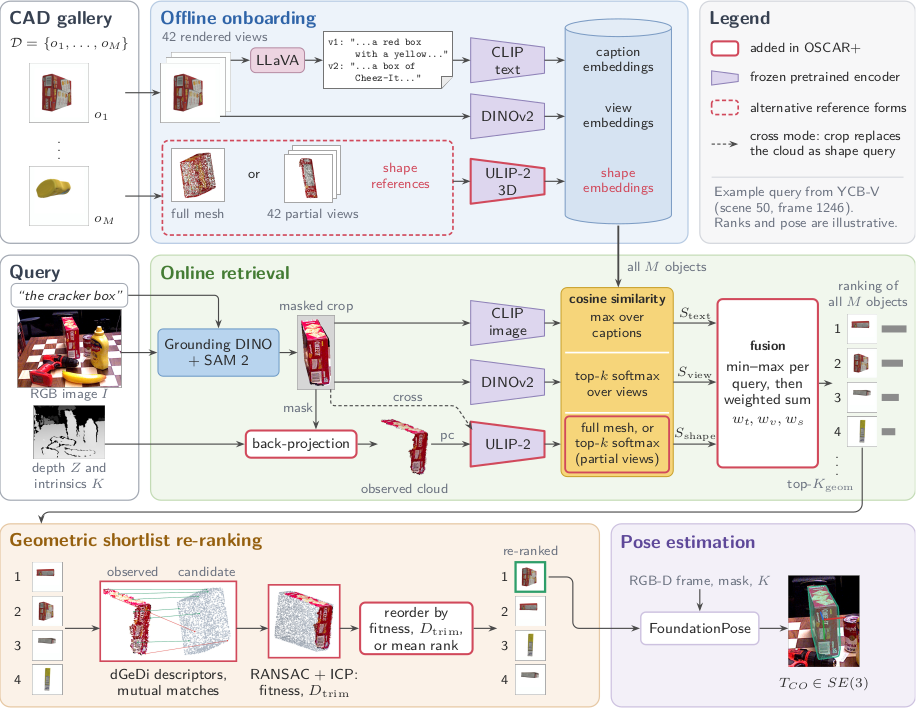

# OSCAR+: Language-Driven CAD Retrieval and 6D Pose from RGB-D

Implementation and evaluation code of the master's thesis
**Evaluating Shape and Geometric Cues for Open-Set CAD Retrieval**
(Thomas Loibelsberger, TU Wien).

OSCAR+ takes one RGB-D image and a plain-language phrase ("the red mug"),
finds the object in the image, searches a gallery of CAD models for the model
that matches it, and estimates the object's 6D pose with the retrieved CAD.
Retrieval combines three signals (a language/semantic channel, an appearance
channel over rendered reference views, and a shape channel over 3D geometry)
and optionally re-ranks the shortlist with a local geometric descriptor check.
It builds directly on **OSCAR**: the retrieval cascade, the
gallery-rendering idea and the two-service container pattern
originate there.

> Pulli et al., *OSCAR: Open-Set CAD Retrieval*, arXiv:2601.07333 (2025).
> <https://github.com/pullover00/OSCAR>

The code in this repository is MIT-licensed (see `LICENSE`). Everything it
depends on (models, the two HTTP services, and every dataset) keeps its own
terms and is downloaded separately; see `THIRD_PARTY_LICENSES.md` before you
use any of it, and note in particular that the two services are licensed for
**non-commercial** use only.

---

## How it works



*Offline onboarding of the CAD gallery (top), online retrieval of one RGB-D
query (middle), geometric shortlist re-ranking and pose estimation (bottom).
Red outlines mark what this work adds to OSCAR; the example query is YCB-V
scene 50, frame 1246. A vector version is in `figures/oscarplus_overview.pdf`.*

A gallery is prepared once per CAD collection so that a query afterwards only
has to be localized, back-projected and compared against caches, which is why
one query costs seconds and not minutes. Eight steps, three of them offline:

1. **Gallery rendering and captioning**: Blender 3.4.1 renders 42 views per
   CAD model, LLaVA-1.5 writes one natural-language description per view.
2. **Shape references**: each rendered view is turned into a partial point
   cloud by hidden-point removal, the alternative being one sample of the full
   mesh; which of the two works better is the question the thesis asks.
3. **Encoders and caches**: CLIP, DINOv2 (or SigLIP), ULIP-2 (or Uni3D) and
   the dGeDi geometric descriptor encode all of that once into caches the
   online steps read.
4. **Language-driven localization**: Grounding DINO turns the prompt into a
   box, SAM 2.1 turns the box into a mask.
5. **Query point cloud**: the masked depth pixels are back-projected into a
   3D point cloud of the observed object part.
6. **Shape matching against the three channels**: the prompt against the
   captions (`S_text`, CLIP), the RGB crop against the rendered views
   (`S_view`, DINOv2), and the query cloud (or the ULIP-2 image tower, in cross
   mode) against the shape references (`S_shape`, ULIP-2).
7. **Fusion and geometric check**: the three channels are combined into one
   ranking (weighted sum by default, reciprocal rank fusion as an
   alternative), and the top of that list is optionally re-ordered by a dGeDi
   descriptor registration against the query cloud.
8. **Pose estimation**: the rank-1 CAD and the query RGB-D go to the
   FoundationPose service, which returns the 6D pose.

Every variant the thesis reports is selectable by a command-line flag:
appearance encoder, shape encoder, query mode, gallery representation, number
of views, fusion weights and operator, candidate scope, and geometry signal.
No combination is hidden in a config file, and a combination that was not
reported is refused rather than silently evaluated.

---

## Requirements / hardware

Everything was developed and measured on one machine, recorded in
`results/hardware.json`:

| | |
|---|---|
| GPU | NVIDIA GeForce RTX 4090, 24 564 MiB (24 GB), driver 555.42.06 |
| CPU | AMD Ryzen 9 5900X, 12 cores / 24 threads |
| RAM | 125 GiB |
| OS | Ubuntu 20.04.6 LTS, kernel 5.15 |
| Container runtime | Docker 28.1.1, docker compose v2.35.1, GPU passthrough |
| In the container | PyTorch 2.10.0+cu128, CUDA 12.8, Python 3.11 |


What you actually need:

* A CUDA GPU that Docker can reach (`docker run --gpus all` must work).
  One `run_pipeline.py` query peaks at **10.1 GB** in the `oscar-plus`
  container (Grounding DINO and SAM 2.1 for localization, then CLIP, DINOv2
  and ULIP-2), and FoundationPose adds **5.2 GB** in its own container, so a
  single query with pose needs about **16 GB** on one card. Measured on an
  RTX 4090 (24 GB) with one YCB-V frame against the 21-object `ycbv` gallery.
  The evaluation runs stay below the same 24 GB.
* Docker with the Compose plugin, and the NVIDIA container toolkit. Start the
  two services **from this repository**: Compose derives its project name from
  the directory, so a service started elsewhere sits on a different network and
  the container will not resolve the hostname `foundationpose` or `dgedi`. If
  a service already runs elsewhere, point at it explicitly, for example
  `--foundationpose-url http://host.docker.internal:5050`.
* Blender **3.4.1** on the host (not in a container) for rendering.
* About 130 GB of free disk space for datasets, CAD models and generated
  galleries; see "Datasets" and "What you have to generate yourself".
* Python 3 on the host. The host only ever runs thin driver code; all heavy
  work happens inside the containers, which the scripts start themselves.

---

## Installation

### 1. Clone the repository

```bash
git clone <this-repository> OSCAR-release
cd OSCAR-release
```

All commands in this README are run **from the repository root**.

### 2. Build the main image

```bash
docker compose build oscar-plus
```

This is the `oscar-plus` service: PyTorch, CLIP/DINOv2/SigLIP/SAM/LLaVA, Open3D,
trimesh and PyBullet. It is where the pipeline, the evaluation drivers and the
container preprocessing stages run.

One optional overlay: the Stage-1 cross-mode query renderer prefers Open3D's
GPU offscreen renderer and falls back to a CPU point-splat renderer when
`libEGL.so.1` is not loadable. The thesis runs had the GL libraries present.
To match that, add them on top of the built image:

```bash
docker build -f Dockerfile.egl -t tholoi/oscar-plus .
```

### 3. The two services

Both services run in their own container and are talked to over HTTP. **Both
are licensed for non-commercial use only** (dGeDi: CC BY-NC 4.0;
FoundationPose: NVIDIA Source Code License). Their code is *not* part of this
repository; you check it out yourself, as a sibling directory of this one.
The directory names matter: `docker-compose.yml` bind-mounts them by name.

**dGeDi** (the geometric descriptor service, used by step 7 and by every
`--geometry` arm). No patch is needed: the whole integration lives in our own
`services/dgedi/server.py`:

```bash
git clone https://github.com/tev-fbk/dGeDi ../dGeDi
docker build -f Dockerfile.dgedi -t oscar-dgedi .
DGEDI_CACHE_DIR=caches/dgedi/bop docker compose up -d dgedi
```

`DGEDI_CACHE_DIR` selects which descriptor gallery the service loads:
`caches/dgedi/bop` for Stage 3/4 and the demo (1316 objects),
`caches/dgedi/shrec` for Stage 1 (3308 objects). Only one at a time; restart
the service with the other value when you switch benchmarks. The Stage-1 and
Stage-3 drivers check the loaded gallery size before they start and print the
exact restart command if it is the wrong one.

**FoundationPose** (the 6D pose service, step 8). Check out the upstream
repository at the commit our patch is written against, apply the patch, and
fetch the weights as the upstream README describes:

```bash
git clone https://github.com/NVlabs/FoundationPose ../FoundationPose
cd ../FoundationPose
git checkout e3d597b
git apply ../OSCAR-release/services/foundationpose/foundationpose.patch
cd ../OSCAR-release
docker compose up -d foundationpose
```

The patch adds the HTTP server the pipeline talks to
(`foundationpose_server.py`), fixes the CUDA-extension build, and removes a
per-call `/tmp` mesh export that fills the disk on long runs. It is a
modification of NVIDIA's code and stays under NVIDIA's terms, not MIT.

Without a running FoundationPose service the pipeline still produces the
retrieval ranking; the pose columns stay empty. A *failed* FoundationPose call
counts as a failure.

### 4. Shape-encoder checkpoints

Two encoder repositories are cloned as sibling directories and mounted into the
`oscar-plus` container (`../ULIP_thesis` → `/ulip`, `../Uni3D` → `/uni3d`). The
target paths below are the values in `config/paths.yaml`, the container-side
paths, which is what the code sees:

| Checkpoint | Source | Target path (`config/paths.yaml`) | Host location |
|---|---|---|---|
| ULIP-2 PointBERT, 10k points, xyz+rgb (402 MB) | <https://huggingface.co/datasets/SFXX/ulip/tree/main/ULIP-2/pretrained_models> | `checkpoints.ulip2` = `/ulip/checkpoints/ulip2_pointbert_10k.pt` | `../ULIP_thesis/checkpoints/ulip2_pointbert_10k.pt` |
| ULIP-2 PointBERT, 8k points, XYZ only | same release | `checkpoints.ulip2_xyz` = `/ulip/checkpoints/ulip2_pointbert_8k_xyz.pt` | `../ULIP_thesis/checkpoints/ulip2_pointbert_8k_xyz.pt` |
| Uni3D-giant (2.0 GB) | <https://huggingface.co/BAAI/Uni3D> | `checkpoints.uni3d` = `/uni3d/modelzoo/uni3d-g/model.pt` | `../Uni3D/modelzoo/uni3d-g/model.pt` |

```bash
git clone https://github.com/salesforce/ULIP.git ../ULIP_thesis
git clone https://github.com/baaivision/Uni3D.git ../Uni3D
# then place the three checkpoint files at the host locations above
```

The XYZ-only checkpoint is only needed for the "query cloud without colour"
ablation; the Uni3D checkpoint only for the Uni3D shape-encoder ablation.

All remaining pretrained models are pulled from Hugging Face **automatically on
first use** and cached in the `hf_cache` / `torch_cache` / `clip_cache` Docker
volumes: CLIP ViT-B/32, DINOv2-base, SigLIP-base, Grounding DINO, SAM 2.1 and
LLaVA-1.5-7B. The first run is therefore slow and needs network access;
afterwards nothing is downloaded again.

### 5. Blender 3.4.1 on the host

Gallery rendering runs outside the containers and needs **exactly Blender
3.4.1**. Other versions fail *silently*: Blender exits with return code 0 but
writes no images, because the bundled Python has no PIL. The preprocessing
script checks the produced camera-matrix count afterwards and aborts with that
explanation, but it cannot prevent the wasted run.

Download the 3.4.1 archive from <https://download.blender.org/release/Blender3.4/>,
unpack it anywhere, and put the path to the binary into `config/paths.yaml`:

```yaml
tools:
  blender: /opt/blender-3.4.1-linux-x64/blender
```

Alternatively pass `--blender /opt/blender-3.4.1-linux-x64/blender` on the
rendering commands, or export `BLENDER_BIN`; an explicit `--blender` wins over
`BLENDER_BIN`, which wins over `tools.blender`.

---

## Paths

`config/paths.yaml` is the single place where every input and output location
is declared; no other file has to be edited to move data around. The defaults
are relative to the repository root:

| Entry | Default | What lives there |
|---|---|---|
| `data.datasets_root` | `eval/datasets` | downloaded benchmark data: SHREC'18, BOP test scenes, MI3DOR query images |
| `data.cad_root` | `object_database` | CAD models per gallery, plus the generated `descriptions_attributes.json` |
| `tools.blender` | `blender` | the host Blender 3.4.1 binary |
| `checkpoints.ulip2` / `ulip2_xyz` / `uni3d` | see table above | shape-encoder checkpoints (container paths) |
| `generated.gallery_root` | `object_images` | renderings, partial point clouds, embedding caches, one folder per gallery |
| `generated.caches_root` | `caches` | dGeDi descriptor galleries, query-embedding caches, score stores |
| `outputs.runs_root` | `runs` | **every** new experiment or demo run |

Three ways to override, in increasing order of scope:

* **Per command, per entry:** `preprocess_gallery.py`, `run_pipeline.py`,
  `run_pipeline_sim.py` and every script in `experiments/` accept
  `--datasets-root`, `--cad-root`, `--gallery-root`, `--caches-root`,
  `--runs-root`, `--checkpoint-ulip2`, `--checkpoint-ulip2-xyz`,
  `--checkpoint-uni3d` and `--blender`.
* **Per command, whole file:** the same scripts accept
  `--paths-file /path/to/my_paths.yaml`.
* **Globally:** export `OSCAR_PATHS_FILE=/path/to/my_paths.yaml`.

**The one rule that matters: new runs write to `runs/`, never to `results/`.**
`results/` holds the frozen numbers of the thesis. Every experiment writes a
file of the *same name and the same shape* below `runs/`, so a fresh run can be
diffed directly against its counterpart in `results/`.

---

## Datasets

Nothing is downloaded automatically and nothing is redistributed here. You
fetch each dataset from its source and accept its licence there. **ITODD is
restricted to non-commercial research, Google Scanned Objects is CC BY 4.0**,
and the others carry their own terms (see `THIRD_PARTY_LICENSES.md`).

`<datasets_root>` and `<cad_root>` below are the `config/paths.yaml` entries.
The object counts are the ones the preprocessing script verifies.

| Dataset | Role | Source | Expected layout |
|---|---|---|---|
| **SHREC'18 RGB-D-to-CAD** (Pham et al., 3DOR 2018) | Stage 1: 2 101 RGB-D query scans against 3 308 ShapeNetSem CADs | from the track organizers | `<datasets_root>/shrec18/shrec18_full/` with `cad/*.obj` (3 308), `rgbd/*.ply` (2 101), `results/rgbd.*.txt` (relevance lists), `train.csv`, `test.csv` |
| **SHREC'18 official metric kit** | the track's own scorer, used unmodified for the official-track comparison | from the track organizers | `<datasets_root>/shrec18/shrec18_official/` with `rgbd.csv`, `cad.csv`, `metrics.py` |
| **MI3DOR** (SHREC'19 monocular track) | Stage 2: category-level image-to-CAD retrieval, 21 categories | from the benchmark authors | queries `<datasets_root>/mi3dor/image/test/`; CADs `<cad_root>/MI3DOR/model/test/*/*.obj` (3 848) |
| **YCB-V** | Stage 3/4/5 query scenes and target CADs | BOP, <https://bop.felk.cvut.cz> | scenes `<datasets_root>/ycbv/test/`, `<datasets_root>/ycbv/test_targets_bop19.json`, `<datasets_root>/ycbv/models_eval/obj_0000NN.ply`; CADs `<cad_root>/ycbv/<id>/textured_simple.obj` (21) |
| **T-LESS** | Stage 3/4/5 query scenes and target CADs | BOP | scenes `<datasets_root>/tless/test_primesense/`, `test_targets_bop19.json`, `models_eval/`; CADs `<cad_root>/tless/<id>/model.ply` (30) |
| **LM-O** | Stage 3/4/5 query scenes and target CADs | BOP | scenes `<datasets_root>/lmo/test/`, `test_targets_bop19.json`, `models_eval/`; CADs `<cad_root>/lmo/<id>/model.ply` (8) |
| **Google Scanned Objects** | proxy gallery (foreign CADs the pipeline may substitute) | CC BY 4.0 | `<cad_root>/gso/<id>/meshes/model.obj` (1 030; meshes in metres) |
| **HouseCat6D** | proxy gallery | from the dataset release | `<cad_root>/housecat6d/<category>/<id>.obj` (199; metres) |
| **ITODD** | proxy gallery | BOP, non-commercial research only | `<cad_root>/itodd/<id>/model.ply` (28; millimetres) |

The Stage-3/4/5 gallery is the union of the three proxy datasets (1 257
objects, called `G_proxy`) and the 59 target CADs, i.e. **1 316** objects.
Stage 3b runs against `G_proxy` alone, so that the exact model is provably
absent.

---

## What you have to generate yourself

The datasets above are raw input. Everything the retrieval actually reads is
generated locally by `preprocess_gallery.py`, one stage per invocation, run
from the repository root:

| Artefact | Command | Target path | Runs on |
|---|---|---|---|
| Renderings, 42 views + camera matrices | `python3 preprocess_gallery.py --dataset <name> --step render` | `<gallery_root>/<name>/<obj>/<obj>_<v>.png` and `<obj>_<v>_CamMatrix.npy` | **host** (needs Blender 3.4.1) |
| Partial point clouds, one per view | `python3 preprocess_gallery.py --dataset <name> --step partial` | `<gallery_root>/<name>/<obj>/<obj>_<v>_partial.npz` | container (wraps itself) |
| LLaVA view descriptions | `python3 preprocess_gallery.py --dataset <name> --step describe` | `<cad_root>/<name>/descriptions_attributes.json` | container (wraps itself) |
| Embedding caches (CLIP/DINOv2/SigLIP/ULIP-2/Uni3D) | `python3 preprocess_gallery.py --dataset <name> --step embed --passes base,siglip,ulip_fullmesh,ulip_pc_rgb,ulip_pc_xyz,uni3d` | `<gallery_root>/<name>/.*cache*.pt` | container (wraps itself) |
| dGeDi geometry descriptors | `python3 preprocess_gallery.py --dataset <name> --step dgedi` | `<caches_root>/dgedi/<name>/<id>.npz` | **host** (starts the dgedi container) |
| Verify what exists | `python3 preprocess_gallery.py --dataset <name> --step check` | none | anywhere |

`--step all` chains render → partial → describe → embed and resolves the
host/container split itself: the host stage runs directly, each container stage
gets its own `docker compose run`. Start `all` on the host, never inside the
container.

**Host/container rule.** `render` needs the host Blender binary and `dgedi`
needs the host Docker client, so those two must be started on the host. Every
other stage wraps itself into `docker compose run --rm --no-deps oscar-plus`
automatically; you do not have to enter the container. A host stage started
inside the container aborts with an explanation instead of failing silently.

The known gallery names are `shrec18`, `MI3DOR`, `ycbv`, `tless`, `lmo`,
`gso`, `housecat6d`, `itodd`. The defaults (`--views 42`, `--hpr-param 2.8`,
`--jitter-std 0.001`) are exactly the values the evaluation galleries were
built with.

### The two geometry galleries

The `--step dgedi` default writes to `<caches_root>/dgedi/<dataset>`, but the
drivers expect two specific folder names. For **SHREC'18** (3 308 objects, used
by every Stage-1 `--geometry` arm) redirect the output:

```bash
python3 preprocess_gallery.py --dataset shrec18 --step dgedi --dgedi-out caches/dgedi/shrec
```

For **BOP** the geometry gallery is the combined 1 316-object set with
namespaced ids, so it is built from a manifest instead of from one dataset:

```bash
docker compose run --rm --no-deps oscar-plus python3 /app/preprocessing/build_dgedi_manifest.py \
    --datasets all --out caches/dgedi/manifest_bop.json
docker compose run --rm --no-deps dgedi python3 /oscar/preprocessing/precompute_dgedi.py \
    --manifest /oscar/caches/dgedi/manifest_bop.json \
    --out /oscar/caches/dgedi/bop --n-points 10000 --mode multi_scale
```

Each descriptor gallery also needs a `diameters.json` next to the `.npz`
files — the per-candidate scale the service co-scales every query by. Without
it the service rejects every candidate (it says so at startup). For BOP the
diameters are measured from the meshes; SHREC'18 matches scale-invariantly,
so its file holds 1.0 for every object:

```bash
docker compose run --rm --no-deps dgedi python3 /oscar/services/dgedi/compute_diameters.py \
    --manifest /oscar/caches/dgedi/manifest_bop.json \
    --out /oscar/caches/dgedi/bop/diameters.json
docker compose run --rm --no-deps dgedi python3 /oscar/services/dgedi/compute_diameters.py \
    --manifest /oscar/caches/dgedi/manifest_shrec18.json --ones \
    --out /oscar/caches/dgedi/shrec/diameters.json
```

### Size and time

This is the expensive part of the project. Renderings, partial clouds and
embedding caches together come to roughly **60 GB**; the two dGeDi descriptor
galleries add about 7 GB. Building all eight galleries from scratch is several
GPU-days: rendering 3 308 + 3 848 + 1 316 CAD models with Blender, captioning
every view with LLaVA-1.5, and then encoding everything.

A **preprocessed gallery archive** is published separately, so you do not have
to build any of it yourself:

<https://huggingface.co/datasets/daloibl/oscar-plus-galleries>

It contains only self-generated artefacts (renderings, partial clouds,
captions, embedding caches, dGeDi descriptors).
The raw datasets and CAD models are not mirrored; download those from their
original sources as described above.

---

## Preprocessing example

Making your own CAD collection searchable, end to end. `--cad-dir`,
`--mesh-glob` and `--id-mode` describe a layout the built-in table does not
know; `--n-objects` is the count the verification expects.

```bash
# one command, all four stages (start on the host)
python3 preprocess_gallery.py \
    --dataset my_objects \
    --cad-dir /data/my_cads --mesh-glob '*/model.obj' --id-mode parent \
    --n-objects 40 --views 42 \
    --step all

# look at what was produced
python3 preprocess_gallery.py --dataset my_objects \
    --cad-dir /data/my_cads --mesh-glob '*/model.obj' --id-mode parent \
    --n-objects 40 --step check
```

`--id-mode` picks the object id out of the mesh path: `stem` = the file name,
`parent` = the containing folder, `grandparent` = one level above that.

If you want geometric re-ranking for this gallery as well, add
`--step dgedi` and start the dgedi service with
`DGEDI_CACHE_DIR=caches/dgedi/my_objects`.

---

## Demo: one scene, one prompt

### Retrieval and pose → `ranking.csv`

`run_pipeline.py` is the demo entry point: one RGB-D frame plus a prompt in, a
ranked list of CAD models out, with the 6D pose of the rank-1 model. Start it on
the host: it wraps itself into the oscar-plus container (`--no-docker` switches that
off).

```bash
docker compose up -d foundationpose          # needed for the pose

python3 run_pipeline.py \
    --rgb        eval/datasets/ycbv/test/000048/rgb/000001.png \
    --depth      eval/datasets/ycbv/test/000048/depth/000001.png \
    --intrinsics eval/datasets/ycbv/test/000048/scene_camera.json \
    --prompt "the mustard bottle" \
    --gallery ycbv --top-k 5 \
    --out runs/demo/ranking.csv
```

* `--gallery <name>` is resolved through `config/paths.yaml`: CAD models
  `<cad_root>/<name>/`, rendered views `<gallery_root>/<name>/`, captions
  `<cad_root>/<name>/descriptions_attributes.json`. If one of them is missing
  the run aborts and prints the `preprocess_gallery.py` command that builds it.
* `--intrinsics` takes either a BOP `scene_camera.json` (camera matrix and depth
  scale; the frame is picked by the numeric stem of `--rgb`) or four numbers
  `fx,fy,cx,cy`. Without it the defaults of `pipeline/config.py` are used and a
  warning is printed.
* `--top-k` is the number of CSV rows (default 5). The per-channel shortlists
  keep their defaults (CLIP 20, DINOv2 5, ULIP-2 5), so a much larger `--top-k`
  simply yields fewer rows.
* `--geometry-reranking` enables step 7 and needs the dgedi service.
* `--out` may be a file or a directory; the default is
  `<runs_root>/demo/ranking.csv`.

The CSV has one row per candidate, best first:

| Column | Meaning |
|---|---|
| `rank`, `object_id` | position and gallery id in the final ranking (the step-7 order when the geometric check ran, otherwise the step-6 order) |
| `mesh_path` | the mesh file that step 8 would pose |
| `fused_score` | the fused score the ranking is sorted by |
| `clip_score`, `dino_score`, `shape_score` | the three channels `S_text`, `S_view`, `S_shape`, min-max normalised as step 6 uses them |
| `dgedi_fitness`, `trimmed_distance` | RANSAC fitness and trimmed surface distance in mm, filled only with `--geometry-reranking` |
| `foundationpose_confidence` | FoundationPose confidence, rank-1 row only |
| `pose_00` … `pose_33` | the 4×4 camera-from-object matrix, row by row, rank-1 row only |

Columns that stay empty are listed as `note:` lines at the end of the run, so a
missing value is never mistaken for a zero. `run_config.json` (argv, git
revision, time, resolved paths) is written next to the CSV.

### The same run plus a grasp attempt

`run_pipeline_sim.py` takes the same arguments and writes the same
`ranking.csv`, and then stands the rank-1 CAD on a table in PyBullet and lets a
Franka Panda try to grasp it: ten runs, the object rotated 36° further each
time, up to five attempts per run. The output is one number: the success rate.

```bash
docker compose up -d foundationpose

python3 run_pipeline_sim.py \
    --rgb        eval/datasets/ycbv/test/000048/rgb/000001.png \
    --depth      eval/datasets/ycbv/test/000048/depth/000001.png \
    --intrinsics eval/datasets/ycbv/test/000048/scene_camera.json \
    --prompt "the mustard bottle" \
    --gallery ycbv \
    --runs 10 --n-tries 5 --headless
```

The grasp flags on top are `--runs`, `--yaw-step`, `--n-tries`, `--cad-units`,
`--no-grasp` and `--headless`; `pipeline_sim_result.json` (retrieval, pose and
the grasp tally) lands next to the CSV, by default in
`<runs_root>/run_pipeline_sim/`. Drop `--headless` for a live PyBullet window;
the retrieved CAD as a green ghost, grasp candidates in yellow, the active
attempt blue, success green, failure red. That needs X forwarding, which
`docker-compose.yml` already sets up via `DISPLAY`.

What the grasp trial measures is whether the **retrieved** model is graspable.
The estimated 6D pose is reported and recorded but not used to stand the object
up, because a table plane cannot be reconstructed from a single photo. The paired
proxy-versus-original comparison of the thesis is Stage 5 below.

Anyone who needs one of the remaining pipeline flags (fusion operator, encoder
swaps, per-channel top-k, `--skip_steps`, `--until-step`) calls the underlying
orchestrator directly: `python3 -m pipeline.run_pipeline --help`.

---

## Reproducing the thesis numbers

Every reported number has a command that regenerates it, and, with one
exception noted in the Stage-1 table, a file in `results/` to compare against.
The commands run from the repository root, take their paths from
`config/paths.yaml`, and write to `runs/`; the file in `runs/` has the same name
and the same shape as its counterpart in `results/`, so `diff` is the
comparison.

How exact the reproduction is depends on the stage:

* **Stages 1–3** reproduce exactly to the decimals the thesis reports.
* **Stage 4** is a latency measurement and therefore **hardware-dependent**.
  Expect the same order of magnitude and the same ranking of the steps, not
  the same milliseconds.
* **Stage 5** is **not** bit-reproducible: FoundationPose samples pose
  hypotheses stochastically on the GPU, and the PyBullet contact simulation
  compounds that. The parts that *are* fixed are the ones that decide what is
  measured: object selection, the proxy assignment per object, the instances,
  the seeds and all protocol parameters are frozen in `plan.json` and in the
  `PROTOCOL` dictionary of `grasping/trial.py`.

**Six tables reproduce byte-identically** from the frozen per-query records,
because their generators are pure reading scripts with no GPU step:
`results/stage1_shrec18/subcategory_split.csv`,
`results/stage3_bop/channel_recall1.csv`,
`results/stage3_bop/proxy_origin_by_dataset.csv`,
`results/stage3_bop/occlusion_by_visibility.csv`,
`results/stage3_bop/occlusion_by_visibility_normalized.csv` and
`results/stage3_bop/significance.csv`. Point each script at the frozen record
with `--results-root results/stage3_bop` (or `results/stage1_shrec18`) and
`diff` the output.

The thesis tables were renumbered late in the writing, so each row below names
the **table number** *and* the stable LaTeX `\label`. Four tables of the
printed version became figures in the final revision; those rows say so.

### Stage 1: SHREC'18 (`experiments/stage1_shrec18.py`)

One invocation is one configuration. The readable flags are
`--appearance {dinov2,siglip}`, `--shape {ulip2,ulip2-xyz,uni3d}`,
`--shape-mode {pc,cross}`, `--gallery {partial,fullmesh}`,
`--views {8,16,32,42}`, `--weights T,V,S`, `--fusion {weighted,rrf}`,
`--scope {full,clip-top20}`, `--cascade`,
`--clip-select {threshold,threshold-calibrated,visual-first}`,
`--geometry {fitness,trimmed-distance,mean-rank,mean-rank-with-base,post-fusion}`,
`--geom-k {5,20,50}` and `--subset test-split`. The defaults are the reported
base configuration: `--appearance dinov2 --shape ulip2 --shape-mode pc
--gallery partial --views 42 --weights 0.3,0.4,0.3 --fusion weighted`. The full
flag-to-configuration table is printed at the end of
`python3 experiments/stage1_shrec18.py --help`; combinations that were not
reported are refused. Below, `…` stands for
`python3 experiments/stage1_shrec18.py`.

| Thesis item | File in `results/stage1_shrec18/` | Command |
|---|---|---|
| Tab. 6.2 `tab:eval_stage1_headline`: Stage-1 headline grid | `all_arms.csv`, `per_query/<configuration>.json` | one invocation per row; see the flag table in `… --help` |
| Tab. 6.3 `tab:eval_stage1_appearance_encoder`: appearance encoder isolated | rows in `all_arms.csv` | `… --weights 0,1,0` · `… --appearance siglip --weights 0,1,0` |
| Tab. 6.4 `tab:eval_stage1_appearance_views`: appearance at 8/16/32/42 views | rows in `all_arms.csv` | `… --weights 0,1,0 --views {8,16,32,42}`; fused counterparts `… --views {8,16,32}` |
| Tab. 6.5 `tab:eval_stage1_shape_encoder`: shape encoder isolated, incl. the XYZ checkpoint | rows in `all_arms.csv` | `… --weights 0,0,1` · `… --shape uni3d --weights 0,0,1` · `… --shape ulip2-xyz --weights 0,0,1` |
| Tab. 6.6 `tab:eval_stage1_shape_design`: reference form and query mode | rows in `all_arms.csv` | `… --weights 0,0,1` crossed with `--gallery {partial,fullmesh}` and `--shape-mode {pc,cross}` |
| Tab. 6.7 `tab:eval_stage1_reference_matrix`: 2×2 query mode × reference form | rows in `all_arms.csv` | the four cells isolated (`… --weights 0,0,1 [--shape-mode cross] [--gallery fullmesh]`) and fused (same without `--weights`) |
| Tab. 6.8 `tab:eval_stage1_shape_views`: shape at view prefixes V8–V42 | rows in `all_arms.csv` | `… --weights 0,0,1 --views {8,16,32,42}` |
| Tab. 6.9 `tab:eval_stage1_fusion`: weighted sum vs. RRF | rows in `all_arms.csv` | `…` (base) · `… --fusion rrf` |
| Tab. 6.10 `tab:eval_stage1_rrf_sweep`: RRF sensitivity over c | `rrf_sweep.csv` | `python3 experiments/stage1_rrf_sweep.py` |
| Fig. 6.1 `fig:eval_weight_grids`: 66-point weight maps of Stages 1 and 2 (Stage 1 in panels a, b, d, e) | `weight_sweep_pc.csv`, `weight_sweep_cross.csv` + `_manifest.json` | `python3 experiments/stage1_weight_sweep.py --track pc` · `python3 experiments/stage1_weight_sweep.py --track cross` |
| Tab. 6.11 `tab:eval_stage1_geometry_signal`: geometry signals on a shared top-50 shortlist | rows in `all_arms.csv` | `… --geometry fitness --geom-k 50` · `… --geometry trimmed-distance --geom-k 50` · `… --geometry mean-rank --geom-k 50` |
| Tab. 6.12 `tab:eval_stage1_geometry_depth`: re-ranking depth K | rows in `all_arms.csv` | `… --geometry trimmed-distance --geom-k {5,20,50}` |
| Tab. 6.13 `tab:eval_stage1_shape_geometry`: shape channel × shortlist geometry | rows in `all_arms.csv` | `… --geometry {trimmed-distance,mean-rank-with-base} --geom-k 50` · `… --weights 0.43,0.57,0 --geometry post-fusion --geom-k 50` |
| Fig. 6.2 `fig:eval_stage1_categories`: per-category nDCG | `categories_channels.csv` | `python3 experiments/stage1_categories.py --preset fusion` (the archived CSV is a renamed/concatenated form of that output) |
| Tab. 6.14 `tab:eval_stage1_test_subset`: official track comparison, 649 test queries | `official_track_testsplit.csv` | `… --subset test-split` · `… --geometry trimmed-distance --geom-k 50 --subset test-split` |
| §6.2.2 `subsec:eval_stage1_fusion`: OSCAR-style pruning | rows in `all_arms.csv` | `… --cascade` · `… --scope clip-top20` · `… --clip-select threshold` |
| §6.2.2 `sec:eval_stage1_results`, App. A.1.1 `app:stage1_record`: paired significance | `significance_ndcg.csv`, `significance_hit1.csv` | `python3 experiments/stage1_significance.py` |
| §6.2.2 / §7.3: sub-category split of hit@1 | `subcategory_split.csv` | `python3 experiments/stage1_subcategory_split.py` |
| §6.2.2 `sec:eval_stage1_results` (after Tab. 6.7): category flip, partial vs. full mesh | `categories_fullmesh_vs_partial.csv` | `python3 experiments/stage1_categories.py --preset shape-matrix` (the archived CSV is a renamed/concatenated form of that output) |
| Tab. 6.33 `tab:eval_conditional_top1` (§6.7): conditional top-1 inside the geometry shortlist, SHREC + BOP | no archived CSV; derived from the per-query records | `python3 experiments/stage1_shortlist_analysis.py` |
| Fig. 6.6 `fig:eval_reference_form` (§6.7): partial against full-mesh references across the stages | `all_arms.csv` (Stage 1), `fused_partial.json` + `fused_fullmesh.json` (Stage 2), `retrieval_*_{partial,fullmesh}.json` (Stage 3) | the reference-form invocations of each stage listed above |

The geometry rows need the dgedi service with the SHREC gallery:
`DGEDI_CACHE_DIR=caches/dgedi/shrec docker compose up -d dgedi`. The two sweeps
read the score stores an earlier run left in `runs/stage1_shrec18/_cache/`, so
run the base arm (`python3 experiments/stage1_shrec18.py`, and
`… --shape-mode cross` for the cross track) first.

### Stage 2: MI3DOR (`experiments/stage2_mi3dor.py`)

One run produces all seven configurations (`clip_only`, `dino_only`,
`ulip_only`, `fusion`, `oscar_maxview`, `oscar_softmax`, `cascade`) in one
summary. Below, `…` stands for `python3 experiments/stage2_mi3dor.py`.

| Thesis item | File in `results/stage2_mi3dor/` | Command |
|---|---|---|
| Tab. 6.15 `tab:eval_stage2_results`: six official measures, compared with published methods | `official_metrics.csv` + `official_metrics_manifest.json`, `fused_partial.json` | `python3 experiments/stage2_mi3dor.py --gallery partial`, then `python3 experiments/stage2_official_metrics.py` |
| Fig. 6.1 `fig:eval_weight_grids`: 66-point weight maps of Stages 1 and 2 (Stage 2 in panels c, f) | `weight_sweep.csv` + `weight_sweep_manifest.json` | `python3 experiments/stage2_weight_sweep.py` |
| Tab. 6.16 `tab:eval_stage2_reference_form`: reference form isolated and fused, Δ full mesh − partial | `fused_partial.json`, `fused_fullmesh.json`, `official_metrics.csv` | `… --gallery partial` · `… --gallery fullmesh`; then `python3 experiments/stage2_official_metrics.py` |
| Tab. 6.17 `tab:eval_stage2_views`: 8 vs. 42 views (OSCAR legacy comparison) | `legacy_oscar_views8.json`, `official_metrics.csv` | `python3 experiments/stage2_mi3dor.py --gallery fullmesh --views 8` |
| Fig. 6.3 `fig:eval_stage2_categories`: NN per category, 21 categories | `categories.csv` | `python3 experiments/stage2_categories.py` |

`stage2_official_metrics.py` reads the three run folders
(`runs/stage2_mi3dor/partial`, `runs/stage2_mi3dor/fullmesh`,
`runs/stage2_mi3dor_views8/fullmesh`) and needs no GPU. The per-query raw files
of Stage 2 are 264 MB each and are therefore **not** in this repository; the
reported metrics are fully covered by the summary JSONs and
`official_metrics.csv`, and the raw files regenerate with the runs above.

Stage 2 needs the 10 500 query images encoded with the ULIP-2 image branch.
Pre-compute them once with

```bash
python3 evaluation/precompute_ulip_query_embeddings.py
```

which writes `caches/ulip_query_cache_mi3dor.pt` (57 MB). Without that file
every Stage-2 run encodes the queries again in memory. The cache is keyed by
query file name, so it stays valid when `--datasets-root` changes.

### Stage 3: BOP (`experiments/stage3_bop.py`)

Four settings over the same BOP RGB-D queries, selected with `--mode`:
`retrieval` (3a, exact CAD in the gallery, retrieval only), `gt` (exact-CAD
FoundationPose reference), `pose` (3b, proxy-only gallery), `decompose` (3c,
next-best-non-target diagnostic, reuses a stored retrieval run). Below, `…`
stands for `python3 experiments/stage3_bop.py`.

| Thesis item | File in `results/stage3_bop/` | Command |
|---|---|---|
| Tab. 6.18 `tab:eval_stage3a_results`: exact retrieval over 12 284 instances, 1 316-object gallery, incl. the "shape alone" column | `retrieval_cross_partial.json`, `retrieval_cross_fullmesh.json`, `retrieval_pc_partial.json`, `retrieval_pc_fullmesh.json`, `retrieval_oscar_baseline.json`, `channel_recall1.csv` | `… --mode retrieval --query {cross,pc} --gallery {partial,fullmesh}`; baseline `… --mode retrieval --oscar-baseline`; shape-alone column `python3 experiments/stage3_channel_recall.py` |
| Tab. 6.19 `tab:eval_stage3a_reference`: R@1 by query mode × dataset × reference form | the same four `retrieval_*.json` | the same four invocations |
| Tab. 6.20 `tab:eval_stage3a_geometry`: geometric re-ranking of the top 5 | `retrieval_{cross,pc}_geo_{trimmed_distance,fitness}.json` | `… --mode retrieval --query {cross,pc} --geometry {trimmed-distance,fitness}` |
| Tab. 6.21 `tab:eval_stage3_exact_pose`: exact-CAD pose reference (D_sym) | `pose_gt.json` | `… --mode gt` |
| Tab. 6.22 `tab:eval_stage3b_results`: proxy pose (D_sym + ΔD), 1 257-object gallery | `pose_proxy_cross_partial.json`, `pose_proxy_cross_fullmesh.json`, `pose_proxy_cross_geo.json`, `pose_proxy_oscar.json` | `… --mode pose --query cross --gallery {partial,fullmesh}`; `… --mode pose --query cross --geometry trimmed-distance`; `… --mode pose --oscar-baseline` |
| Fig. 6.4 `fig:eval_stage3b_distribution`: distribution of the posed-surface distance | `pose_proxy_cross_partial.json` (field `all_records`) | the same run as Tab. 6.22 |
| Tab. 6.23 `tab:eval_stage3c_results`: D_sym by proxy provenance × dataset | `pose_decomposition_cross.json`, `pose_decomposition_cross_fullmesh.json`, `proxy_origin_by_dataset.csv` | `… --mode decompose --query cross --gallery partial --from-retrieval runs/stage3_bop_retrieval_cross_partial` (and the full-mesh twin); provenance CSV `python3 experiments/stage3_proxy_origin.py` |
| Tab. 6.24 `tab:eval_stage3d_occlusion`: visibility classes, 3a + 3b | `occlusion_by_visibility.csv`, `occlusion_by_visibility_normalized.csv` | `python3 experiments/stage3_occlusion.py` |
| Tab. 6.25 `tab:eval_stage3d_per_dataset`: R@1 per visibility class × dataset | `occlusion_by_visibility.csv` | `python3 experiments/stage3_occlusion.py` |
| §6.4 `subsec:eval_stage3_configuration`: paired significance over instance keys | `significance.csv` | `python3 experiments/stage3_significance.py` |

`--mode gt`, `--mode pose` and `--mode decompose` need the FoundationPose
service; `--geometry` needs the dgedi service with the BOP gallery
(`DGEDI_CACHE_DIR=caches/dgedi/bop`). `--mode pose` pairs against the `gt` run
(`--gt-records`, default `runs/stage3_bop_gt/combined_gt.json`), so run
`--mode gt` first. Output folder names are derived as
`stage3_bop_<mode>_<query>_<gallery>[_geo_<signal>]`, which is where the
`--from-retrieval` paths above come from.

### Stage 4: latency (`experiments/stage4_latency.py`, `stage4_onboarding.py`, `stage4_onboarding_warm.py`)

Hardware-dependent; reproduce the order of magnitude, not the milliseconds.
Pose measurement is on by default (`--no-pose` disables it). Below, `…` stands
for `python3 experiments/stage4_onboarding.py`.

| Thesis item | File in `results/stage4_latency/` | Command |
|---|---|---|
| Tab. 6.26 `tab:eval_stage4_query`: query latency, 50 queries per view count, geometry K=5 + pose, 1 316-object gallery | `query_latency_geo_pose.json` + `_manifest.json`, `query_latency.json`, `query_latency_geo.json` | `python3 experiments/stage4_latency.py --dataset ycbv --n-queries 50 --views 16,42 --geometry --geo-k 5` · the same without `--geometry` |
| Tab. 6.27 `tab:eval_onboarding`: onboarding cost per CAD, n=59 | `onboarding.json`, `onboarding_render.json`, `onboarding_dgedi_cold.json`, `onboarding_dgedi_warm.json` + `_manifest.json`, `onboarding_warm_render_describe.json` + `_manifest.json` | `… --stages mesh,partial,describe,embed --num-views 16,42` · `… --stages render` · `… --stages dgedi` · warm: `python3 experiments/stage4_onboarding_warm.py --step {render,describe,dgedi}` |
| Tab. 6.28 `tab:eval_stage4_views`: 16 vs. 42 views, cost against Stage-1 quality | `onboarding.json`, `query_latency*.json`, plus the Stage-1 view rows | the same invocations with `--num-views 16,42` resp. `--views 16,42` |
| §6.5.3 `subsec:eval_stage4_onboarding_steps`: cache invalidation and incremental cost | `invalidation_embed.json`, `invalidation_describe.json` | `… --stages embed --measure-invalidation` · `… --stages describe,embed` |
| §6.5.3: representation cost, partial vs. full mesh | `onboarding_fullmesh.json`, `partial_ablation.json`, `views_ablation.json`, `query_latency_fullmesh.json` | `… --stages mesh,describe,embed --shape-source fullmesh --reuse-renders --num-views 16,42` · `… --stages partial,embed --num-views 16,42 --max-objects 3` · `… --stages describe,embed --num-views 16,42 --max-objects 3` · `python3 experiments/stage4_latency.py --dataset ycbv --n-queries 50 --views 16,42 --shape-source fullmesh` |
| Tab. A.6 `tab:app_stage4_record`: hardware record | `results/hardware.json` | collected with `lscpu` / `nvidia-smi` / `docker version`; see the Requirements section |

`--stages render` and `--stages dgedi` run on the host, everything else wraps
itself into the container; a host/container mixture is rejected, so call them
separately and give each its own `--out`. The frozen files were named by
`--out`; the defaults write `<runs_root>/stage4_onboarding/onboarding.json`
resp. `<runs_root>/stage4_onboarding_warm/<step>_timings.json`.

### Stage 5: grasping (`experiments/stage5_grasping.py`)

52 graspable BOP target objects × 10 placements × 3 conditions (own CAD,
3b proxy, 3c substitute) = 1 560 trials. The plan is derived from the frozen
Stage-3 records, so the object set and the proxy assignment are fixed even
though the physics is not bit-reproducible.

| Thesis item | File in `results/stage5_grasping/` | Command |
|---|---|---|
| Tab. 6.29 `tab:eval_stage5_conditions`: the three compared models per object | `plan.json` | `python3 experiments/stage5_grasping.py --plan-only` (built as part of the run below) |
| Tab. 6.30 `tab:eval_grasp_results`: success rates over 52 objects × 10 placements, and D_sym | `trials.csv` | `python3 experiments/stage5_grasping.py` (default `--conditions gt,proxy,proxy3c`) |
| Tab. 6.31 `tab:eval_stage5_paired`: paired outcomes per placement | `trials.csv` | the same run |
| Tab. 6.32 `tab:eval_stage5_failures`: failure taxonomy per model, 520 trials per condition | `trials.csv`, column `outcome` | the same run |
| Tab. A.8 `tab:eval_stage5_parameters`: simulation parameters | fixed in `grasping/trial.py` (the `PROTOCOL` dictionary) and recorded in `plan.json` | none (constants) |
| Tab. A.9 / A.10 `tab:app_stage5_objects_a` / `tab:app_stage5_objects_b`: per object (YCB-V/LM-O resp. T-LESS) | `trials.csv`, aggregated | the same run; `python3 experiments/stage5_grasping.py --report` prints the rates |
| Fig. 5.2 / Fig. 6.5 `fig:eval_stage5_proxy_pairs`: scene and object figures, videos | `viz/ycbv14_proxy/`, `viz/tless3_proxy/`, `viz/lmo10_proxy/` (`grasp.mp4`, `overlay.png`) | `docker compose run --rm oscar-plus python3 /app/experiments/stage5_visualize.py --object ycbv:14 --proxy housecat6d/cup-red_heart` |

The run needs the FoundationPose service (`docker compose up -d
foundationpose`) and wraps itself into the oscar-plus container. To compute against
the exact plan of the thesis, pass
`--plan results/stage5_grasping/plan.json`. `--report` and `--plan-only` need
neither container nor service.

---

## Notes on reproducibility

**Seeding.** `PYTHONHASHSEED=0` is set by every driver before it starts, and
all explicit RNGs (Python, NumPy, torch, CUDA) are seeded. Four environment
variables that change results are *derived*, not user flags; the drivers set
them from the chosen configuration and record them in `run_config.json`:
`SHREC_FORCE_PARTIAL_CACHE`, `SHREC_DINO_POOLING`, `STAGE1_GEOMETRY_BACKEND`
and `DGEDI_CACHE_DIR`.

**What is not bit-reproducible, and why we say so instead of hiding it.**
FoundationPose samples pose hypotheses stochastically on the GPU; the
refinement iteration count is fixed and the returned pose is stored, but
repeated calls can differ slightly. Open3D's RANSAC inside the dGeDi service is
seeded server-side where the Open3D build supports a seed; older builds ignore
it. Both affect Stage 3's pose modes and Stage 5, not the retrieval metrics.

**Run provenance.** Every run writes a `run_config.json` next to its results,
holding `argv`, the derived internal configuration, the relevant environment
variables, the torch/GPU identification and the git revision. The sweeps and
metric tables additionally ship a `*_manifest.json` with the commit and the
configuration of the run that produced them.

**Official MI3DOR metrics.** The six official measures are computed by a Python
port of the benchmark's own evaluator, `Retrieval/cross_performance.m` from
repository `tianbao-li/MI3DOR` at commit **4325c24c**. The port is
`evaluation/mi3dor_official_metrics.py`, driven by
`experiments/stage2_official_metrics.py`. It refuses to write anything if it
misses the archived reference values.

**Official SHREC'18 metrics.** The track comparison uses the organizers'
unmodified `metrics.py` from `<datasets_root>/shrec18/shrec18_official/`. It is
not redistributed here.

**`results/` is frozen.** It holds the values as reported in the thesis and no
script ever writes into it. Reading scripts *can* be pointed at it
(`--results-root results/stage1_shrec18`), which is how you verify a
reproduction without recomputing the expensive passes.

**Configuration names.** File and folder names in `results/` are the *release*
names of the configurations (`fusion`, `fusion_geo_trimmed_distance`,
`retrieval_cross_partial`, `pose_proxy_cross_partial`, `fused_partial`) rather
than the internal ablation keys the drivers use (`E1c_full_fusion`,
`3a_cross_v2`). The mapping in both directions, and the reasoning behind
keeping the two systems apart, is `evaluation/configuration_names.py`. Every
reading script accepts either name on its command line.

---

## Repository layout

```
.
├── README.md                    this file, the only documentation
├── LICENSE                      MIT
├── THIRD_PARTY_LICENSES.md      terms of every external component and dataset
├── requirements.txt             Python dependencies of the oscar image
├── docker-compose.yml           the three services: oscar, dgedi, foundationpose
├── Dockerfile                   the oscar image
├── Dockerfile.dgedi             the dGeDi service environment (CUDA 11.8)
├── Dockerfile.egl               optional GL overlay on the oscar image
├── config/
│   └── paths.yaml               every input and output location, with defaults
├── pipeline/                    the eight online steps, config, path registry, shared demo CLI
├── preprocessing/               rendering, partial clouds, captions, embeddings, dGeDi descriptors
├── preprocess_gallery.py        one entry point for all gallery preprocessing
├── run_pipeline.py              demo: one scene + one prompt -> ranking.csv + pose
├── run_pipeline_sim.py          the same, plus a PyBullet grasp attempt on rank 1
├── evaluation/                  shared evaluation library, metrics, configuration names
├── experiments/                 one script per experiment of Stages 1–5
├── grasping/                    Stage-5 library: scene, grasp sampler, executor, trial runtime
├── services/
│   ├── dgedi/                   our HTTP wrapper around the dGeDi repository
│   └── foundationpose/          our patch against FoundationPose upstream e3d597b
└── results/                     the frozen thesis record, never written to
    ├── hardware.json            the reference system
    ├── stage1_shrec18/          SHREC'18 retrieval (+ per_query/)
    ├── stage2_mi3dor/           MI3DOR category retrieval
    ├── stage3_bop/              BOP retrieval and pose (+ per_query/)
    ├── stage4_latency/          query and onboarding latency
    └── stage5_grasping/         grasp trials, plan, videos (viz/)
```

`run_pipeline.py` and `run_pipeline_sim.py` share one argument definition
(`pipeline/demo_cli.py`), which is what keeps their interface and their
`ranking.csv` identical. The orchestrator they both drive is
`pipeline/run_pipeline.py`, callable directly as
`python3 -m pipeline.run_pipeline` when you need a flag the demo interface does
not expose.

---

## Citation

If you use this repository, please cite the thesis (Thomas Loibelsberger,
*Evaluating Shape and Geometric Cues for Open-Set CAD Retrieval*, master's
thesis, TU Wien) and the work it builds on:

> Pulli et al., *OSCAR: Open-Set CAD Retrieval*, arXiv:2601.07333 (2025).
> <https://github.com/pullover00/OSCAR>

When you report numbers on a benchmark, cite that benchmark as well (SHREC'18,
Pham et al., 3DOR 2018; MI3DOR; and the BOP datasets) and cite the encoders
and services you actually ran: ULIP-2, Uni3D, dGeDi, FoundationPose,
Grounding DINO, SAM 2.1, DINOv2, SigLIP, CLIP and LLaVA-1.5. The full list with
licences is in `THIRD_PARTY_LICENSES.md`.
